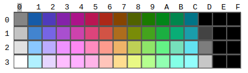

# Palette

- The NES palette isn’t RGB based so every TV will produce slightly different shades of each color. The following is a rough guide of what colors get produced.
- 

- The colors are numbered as the first nibble being the row and the second nibble being the column.  The top left color of gray = #$00, the top right color of black = #$0F, the bottom left color of white = #$30, and the bottom right color of black = #$3F.  The color of #$0D is “Blacker than Black” and is not to be used as it will cause some TVs to screw up.
- The palette is stored in palette RAM ($3F00-$3F1F).
  - Background Palette 0 = $3F00-$3F03
  - Background Palette 1 = $3F04-$3F07
  - Background Palette 2 = $3F08-$3F0B
  - Background Palette 3 = $3F0C-$3F0F
  - Object Palette 0     = $3F10-$3F13
  - Object Palette 1     = $3F14-$3F17
  - Object Palette 2     = $3F18-$3F1B
  - Object Palette 3     = $3F1C-$3F1F
- $3F10 is the universal background color and will overwrite any color in $3F00, $3F04, $3408, $3F0C, $3F14, $3F18, and $3F1C.  Each palette contains a transparent background color followed by three colors.
