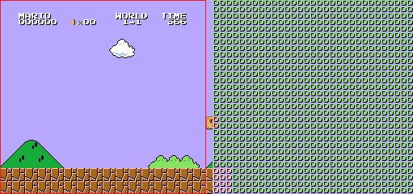
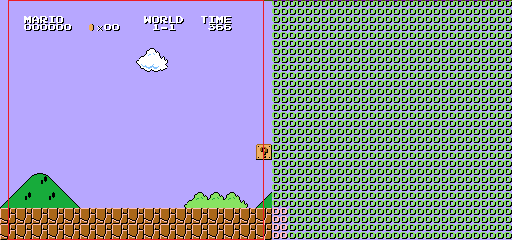
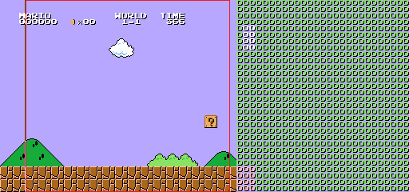
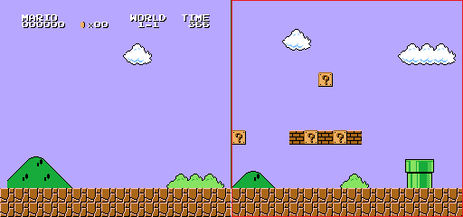
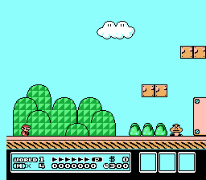
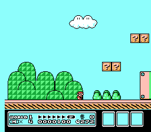

# Scrolling

The $2000 Register sets the name table to be displayed.

The $2005 Register sets the scroll.  The first write sets the left/right value and the second write sets the up/down value.  For example:

```nasm
LDA SOFT_2000  ; Get $2000 Settings
AND #%11111100  ; Remove Name Table
ORA NAME_TABLE  ; Add Name Table
STA $2000    ; Store $2000 Settings
LDA XSCROLL    ; Set Left / Right Scroll
STA $2005
LDA YSCROLL    ; Set Up / Down Scroll
STA $2005
```

Mirroring has a great effect on our scrolling.  When we want to scroll left and right like Super Mario Bros., we should use vertical mirroring so we can use name table 0 and name table 1.  When we want to scroll up and down like Ice Climber, we should use horizontal mirroring so we can use name table 0 and name table 2.

The process for scrolling left/right or up/down is the same but on a different axis.  The following will be based for a left/right scroll.

## Reset

In the Reset Routine, we need to load the initial screen and set the initial screen location (in 16-bits).

```nasm
load_name_table:
  LDA #$21      ; Set Number of Columns to Draw
  STA DRAW_WIDTH
@column:
  LDX XSCROLL+0    ; X Lo
  LDY XSCROLL+1    ; X Hi
  JSR get_column    ; Get Name Table and Source Addresses
  LDA #$1E      ; Number of Rows in Column
  STA DRAW_HEIGHT
  JSR draw_column    ; Draw Column to VRAM
  LDX XSCROLL+0    ; X Lo
  LDY XSCROLL+1    ; X Hi
  JSR get_attribute    ; Get Attribute Table and Source Addresses
  JSR draw_attribute  ; Draw Attribute to VRAM
  LDA XSCROLL+0    ; Next Column
  CLC
  ADC #<$0008
  STA XSCROLL+0
  LDA XSCROLL+1
  ADC #>$0008
  STA XSCROLL+1
  DEC DRAW_WIDTH    ; Last Column?
  BNE @column
  LDA XSCROLL+0    ; Set to Original Location
  SEC
  SBC #<$0108
  STA XSCROLL+0
  LDA XSCROLL+1
  SBC #>$0108
  STA XSCROLL+1
  RTS

get_column:
  ; Get Name Table Address
  TXA        ; X Lo / 8 = Name Table Address Lo
  LSR
  LSR
  LSR
  STA VRAM_ADDRESS+0
  TYA        ; X Hi
  AND #%00000001    ; Even X Hi = Name Table 0, Odd X Hi = Name Table 1
  ASL        ; Name Table * 4 + $20 = Name Table Address Hi
  ASL
  ADC #>$2000
  STA VRAM_ADDRESS+1
  ; Get Source Index
  LDA XSCROLL+0    ; X / 8 = Column
  STA SOURCE+0
  LDA XSCROLL+1
  STA SOURCE+1
  LSR SOURCE+1
  ROR SOURCE+0
  LSR SOURCE+1
  ROR SOURCE+0
  LSR SOURCE+1
  ROR SOURCE+0
  ASL SOURCE+0    ; (Column * 32) - (Column * 2) = Source Index
  ROL SOURCE+1
  LDA SOURCE+0
  STA TEMP+0
  LDA SOURCE+1
  STA TEMP+1
  ASL SOURCE+0
  ROL SOURCE+1
  ASL SOURCE+0
  ROL SOURCE+1
  ASL SOURCE+0
  ROL SOURCE+1
  ASL SOURCE+0
  ROL SOURCE+1
  LDA SOURCE+0
  SEC
  SBC TEMP+0
  STA SOURCE+0
  LDA SOURCE+1
  SBC TEMP+1
  STA SOURCE+1
  ; Get Source Address
  LDA SOURCE+0    ; Source Index + Source = Source Address
  CLC
  ADC #<title_name_table
  STA SOURCE+0
  LDA SOURCE+1
  ADC #>title_name_table
  STA SOURCE+1
  RTS

draw_column:
  LDA SOFT_2000    ; Get $2000 Settings
  ORA #%00000100    ; Set VRAM Increment Down
  STA $2000      ; Store VRAM Increment
  LDA VRAM_ADDRESS+1  ; Store VRAM Address
  STA $2006
  LDA VRAM_ADDRESS+0
  STA $2006
  LDX DRAW_HEIGHT    ; Set Rows to Draw
  LDY #$00
:  LDA (SOURCE),Y    ; Store Tile in VRAM
  STA $2007
  INY        ; Next Tile
  DEX        ; Last Row?
  BNE :-
  RTS

get_attribute:
  ; Get Attribute Table Address
  TXA        ; X Lo / 32 + $C0 = Attribute Table Address Lo
  LSR
  LSR
  LSR
  LSR
  LSR
  CLC
  ADC #<$23C0
  STA VRAM_ADDRESS+0
  TYA        ; X Hi
  AND #%00000001    ; Even X Hi = Name Table 0, Odd X Hi = Name Table 1
  ASL        ; Name Table * 4 + $23 = Attribute Table Address Hi
  ASL
  ADC #>$23C0
  STA VRAM_ADDRESS+1
  ; Get Source Index
  LDA XSCROLL+0    ; X / 32 = Column
  STA SOURCE+0
  LDA XSCROLL+1
  STA SOURCE+1
  LSR SOURCE+1
  ROR SOURCE+0
  LSR SOURCE+1
  ROR SOURCE+0
  LSR SOURCE+1
  ROR SOURCE+0
  LSR SOURCE+1
  ROR SOURCE+0
  LSR SOURCE+1
  ROR SOURCE+0
  ASL SOURCE+0    ; Column * 8 = Source Index
  ROL SOURCE+1
  ASL SOURCE+0
  ROL SOURCE+1
  ASL SOURCE+0
  ROL SOURCE+1
  ; Get Source Address
  LDA SOURCE+0    ; Source Index + Source = Source Address
  CLC
  ADC #<title_attribute_table
  STA SOURCE+0
  LDA SOURCE+1
  ADC #>title_attribute_table
  STA SOURCE+1
  RTS

draw_attribute:
  LDY #$00      ; Set to First Attribute
@loop:
  LDA VRAM_ADDRESS+1  ; Store VRAM Address
  STA $2006
  LDA VRAM_ADDRESS+0
  STA $2006
  LDA (SOURCE),Y    ; Store Attribute in VRAM
  STA $2007
  INY        ; Next Attribute
  CPY #$08      ; Last Attribute?
  BEQ @exit
  LDA VRAM_ADDRESS+0  ; Next VRAM Address
  CLC
  ADC #$08
  STA VRAM_ADDRESS+0
  JMP @loop
@exit:
  RTS

title_name_table:
  .incbin "level1.bin"  ; Name Table

title_attribute_table:
  .incbin "attrib.bin"  ; Attribute Table
```

### NMI

In the NMI, we need to update the scroll.

```nasm
update_scroll:
  LDA SOFT_2000    ; Get $2000 Settings
  AND #%11111100    ; Remove Name Table
  STA SOFT_2000
  LDA XSCROLL+1    ; Get Name Table
  AND #%00000001
  ORA SOFT_2000    ; Add $2000 Settings
  STA SOFT_2000    ; Store $2000 Settings
  STA $2000
  LDA XSCROLL+0    ; Set Vertical Scroll Offset
  STA $2005
  LDA YSCROLL      ; Set Horizontal Scroll Offset
  STA $2005
  RTS
```

Now we have loaded the initial name table (the red box) and one column in the next name table.



## Game Loop

In the Game Loop, we need to calculate the scrolling and buffer new columns and attributes.

```nasm
scroll_check:
  LDA #$00      ; Clear Direction
  STA X_DIRECTION
  JSR move      ; Check Movement
  JSR column_check    ; New Column?
  JSR attribute_check  ; New Attribute?
  RTS

move:
@left:
  LDA JOYRAW1      ; Left Button?
  AND #LEFT_BUTTON
  BEQ @right
  LDA XSCROLL+0    ; Move Left?
  CMP #<$0001      ; Max Scroll Left Lo
  LDA XSCROLL+1
  SBC #>$0001      ; Max Scroll Left Hi
  BCC @exit
@moveleft:
  LDA DRAW_FLAG    ; Wait for Previous Draw
  BNE @moveleft
  LDA #$FF      ; Speed Left
  STA X_DIRECTION
  CLC        ; Change Scroll by Speed
  ADC XSCROLL+0
  STA XSCROLL+0
  LDA XSCROLL+1
  SBC #$00
  STA XSCROLL+1
  JMP @exit
@right:
  LDA JOYRAW1      ; Right Button?
  AND #RIGHT_BUTTON
  BEQ @exit
  LDA XSCROLL+0    ; Move Right?
  CMP #<$0300      ; Max Scroll Right Lo
  LDA XSCROLL+1
  SBC #>$0300      ; Max Scroll Right Hi
  BCS @exit
@moveright:
  LDA DRAW_FLAG    ; Wait for Previous Draw
  BNE @moveright
  LDA #$01      ; Speed Right
  STA X_DIRECTION
  CLC        ; Change Scroll by Speed
  ADC XSCROLL+0
  STA XSCROLL+0
  LDA XSCROLL+1
  ADC #$00
  STA XSCROLL+1
@exit:
  RTS
```

After we have moved 8 pixels, we need to draw a new column.

```nasm
column_check:
  LDA XSCROLL+0    ; Moved 8 pixels?
  AND #%0000111
  BNE @exit
  LDA X_DIRECTION    ; No Movement?
  BEQ @exit
  BPL @right      ; Moved Left or Right?
@left:
  LDA XSCROLL+0    ; Set to New Column
  SEC
  SBC #<$0010
  STA XSCROLL+0
  TAX
  LDA XSCROLL+1
  SBC #>$0010
  STA XSCROLL+1
  TAY
  JSR get_column    ; Get Name Table and Source Addresses
  JSR buffer_column    ; Buffer Column
  LDA XSCROLL+0    ; Set to Current Column
  CLC
  ADC #<$0010
  STA XSCROLL+0
  LDA XSCROLL+1
  ADC #>$0010
  STA XSCROLL+1
  JMP @exit
@right:
  LDA XSCROLL+0    ; Set to New Column
  CLC
  ADC #<$0100
  STA XSCROLL+0
  TAX
  LDA XSCROLL+1
  ADC #>$0100
  STA XSCROLL+1
  TAY
  JSR get_column    ; Get Name Table and Source Addresses
  JSR buffer_column    ; Buffer Column
  LDA XSCROLL+0    ; Set to Current Column
  SEC
  SBC #<$0100
  STA XSCROLL+0
  LDA XSCROLL+1
  SBC #>$0100
  STA XSCROLL+1
@exit:
  RTS

buffer_column:
  LDX VRAM_ADDRESS+0  ; Set VRAM Address Lo
  LDA VRAM_ADDRESS+1  ; Set VRAM Address Hi
  CLC
  ADC #%10000000    ; Add VRAM Increment Down
  TAY
  LDA #$1E      ; Set Number of Rows in Column
  JSR buffer_vram
  RTS
```

Now the scroll has moved 8 pixels right in the name table (the red box) and the next column is ready to move right.  We also see that the previous column is still available to move left.



After we have moved 32 pixels, we need to draw a new attribute.

```nasm
attribute_check:
  LDA XSCROLL+0    ; Moved 32 pixels?
  AND #%00011111
  BNE @exit
  LDA X_DIRECTION    ; No Movement?
  BEQ @exit
  BPL @right      ; Left or Right?
@left:
  LDA XSCROLL+0    ; Set to New Column
  SEC
  SBC #<$0010
  STA XSCROLL+0
  TAX
  LDA XSCROLL+1
  SBC #>$0010
  STA XSCROLL+1
  TAY
  JSR get_attribute    ; Get Attribute Table and Source Addresses
  JSR buffer_attribute  ; Buffer Attribute
  LDA XSCROLL+0    ; Set to Current Column
  CLC
  ADC #<$0010
  STA XSCROLL+0
  LDA XSCROLL+1
  ADC #>$0010
  STA XSCROLL+1
  JMP @exit
@right:
  LDA XSCROLL+0    ; Set to New Column
  CLC
  ADC #<$0100
  STA XSCROLL+0
  TAX
  LDA XSCROLL+1
  ADC #>$0100
  STA XSCROLL+1
  TAY
  JSR get_attribute    ; Get Attribute Table and Source Addresses
  JSR buffer_attribute  ; Buffer Attribute
  LDA XSCROLL+0    ; Set to Current Column
  SEC
  SBC #<$0100
  STA XSCROLL+0
  LDA XSCROLL+1
  SBC #>$0100
  STA XSCROLL+1
@exit:
  RTS

buffer_attribute:
  LDY #$00      ; Set Attribute Row Index
@loop:
  TYA        ; Store Attribute Row Index
  PHA
  LDX VRAM_ADDRESS+0  ; Set VRAM Address Lo
  LDY VRAM_ADDRESS+1  ; Set VRAM Address Hi
  LDA #$01      ; Set Number of Attributes
  JSR buffer_vram
  PLA        ; Get Attribute Row Index
  TAY
  INY        ; Next Attribute Row
  CPY #$08      ; Last Attribute Row?
  BEQ @exit
  LDA VRAM_ADDRESS+0  ; Next Attribute Row Address
  CLC
  ADC #$08
  STA VRAM_ADDRESS+0
  INC SOURCE+0    ; Next Source Address
  BNE @loop
  INC SOURCE+1
  JMP @loop
@exit:
  RTS
```

Now the scroll has moved 32 pixels right in the name table (the red box) and the next column is ready to move right.



When we scroll 256 pixels right (below XSCROLL = #$0100), it is important to make sure to change the name table to be displayed (the red box) else you’ll incorrectly wrap back to the first column.  The new columns being drawn will occur on the old name table as we see with the first column.



Scroll Both Up/Down and Left/Right:

The process for doing both is harder but works in a similar manner.  We need to update either all the up/down scrolling or all the left/right scrolling then the other in the game loop.

However, unless we are using a mapper with 4-way scrolling then mirroring gets in the way as we have no free columns in vertical mirroring and no free rows in horizontal mirroring.  To work around this, we can use the $2001 Register to clip the left column of the screen allowing one free column with horizontal mirroring.

We can see the clipping being used in the screenshot of Super Mario Bros. 3



Because we only have one column to handle both left and right movement, we will see “screen artifacts”.  “Screen artifacts” are previous column or attribute values on the edge of the screen.  In the following snapshot, we see the previous attribute value making part of the pink box green.



We also have to adjust the left/right update sizes to smaller increments.  At the forth pixel move right, we need to update the column.  At the eighth pixel move right, we need to update the first half of the attribute.  At the twenty-fourth pixel move right, we need to update the second half of the attribute.  Note: there are advanced techniques to create smaller “screen artifacts” than the original Super Mario Bros. 3 or even none.
