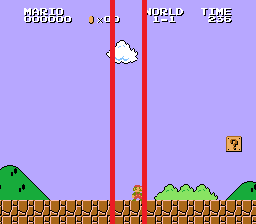
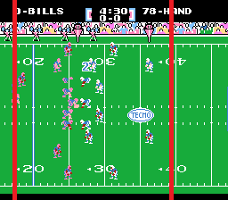

# Camera Window (or Trap)

It can be disorienting when the screen moves every pixel the character moves and we also need the screen to snap on the main object so we don’t lose sight.

A window or sometimes called a trap is an area on the screen that we want to contain the main object.  When the main object is inside the window the screen stays static regardless if the main object is moving or not.  When the main object pushes the edge of the window then the screen scrolls along.  When the main object is able to speed past the window then the screen increases speed as much as possible and attempts to catch up.  We will have windows for either or both horizontal and vertical movement.

A platform game like Super Mario Bros. has a narrow horizontal window snapped onto Mario like the image below.  The purpose is to allow sight of enemies at either direction with room to make slight adjustments without the screen changing.



A sports game like Tecmo Super Bowl has a wide horizontal window snapped onto the location of the football like the image below.  The purpose is that most action will occur in the window but we need some room out in front to view incoming tacklers as we move upfield.



The scroll movement in the game loop will change to handle the window instead of moving with the controller.

```lisp
move:
	LDA SPRITE_X_LO	; Get Main Object Location
	SEC
	SBC XSCROLL+0
	TAY
	LDA SPRITE_X_HI
	SBC XSCROLL+1
	BMI @leftmax	; Past Left of Screen
	BNE @rightmax	; Past Right of Screen
	TYA			; Hit Left Window?
	SEC
	SBC #$62
	BCC @lefttrap
	TYA			; Hit Right Window?
	SEC
	SBC #$82
	BCC @exit
@righttrap:
	CMP #$04		; Scroll Speed Right
	BCC @right
@rightmax:
	LDA #$04		; Set Max Scroll Speed
@right:
	TAX
	LDA XSCROLL+0	; Max Scroll Right?
	CMP #<$02FF
	LDA XSCROLL+1
	SBC #>$02FF
	BCS @exit
	TXA
	STA X_DIRECTION	; Change Scroll by Speed
	CLC
	ADC XSCROLL+0
	STA XSCROLL+0
	LDA XSCROLL+1
	ADC #$00
	STA XSCROLL+1
	RTS
@lefttrap:
	CMP #$FC		; Scroll Speed Left
	BCS @left
@leftmax:
	LDA #$FC		; Set Max Scroll Speed
@left:
	TAX
	LDA XSCROLL+0	; Max Scroll Left?
	CMP #<$0003
	LDA XSCROLL+1
	SBC #>$0003
	BCC @exit
	TXA
	STA X_DIRECTION	; Change Scroll by Speed
	CLC
	ADC XSCROLL+0
	STA XSCROLL+0
	LDA XSCROLL+1
	SBC #$00
	STA XSCROLL+1
@exit:
	RTS
```
