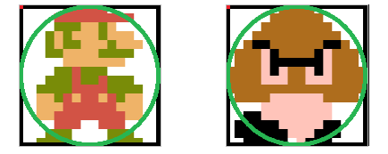
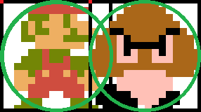
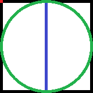
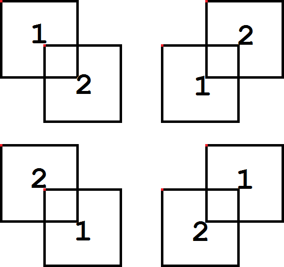
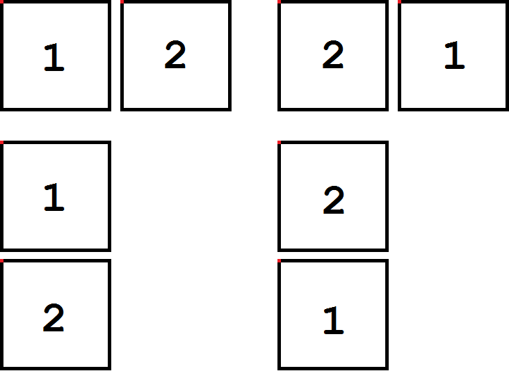
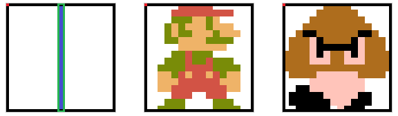
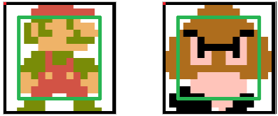
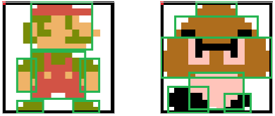

# Sprite Collisions

A sprite collision is when parts of two sprites/metasprites occupy the same location.  The NES has no feature that tells us when this happens so we must calculate this occurrence.  Sprite coordinates are stored at the top left corner, the hot spot, with the top left corner of the screen being location 0,0.  A hot spot is the initial coordinates of a sprite/metasprite.  Some games will store the hot spot in a different location than the top left corner after using a calculation.  The reason for this is to make for easier/better collision detection.

In the game loop, we will check a sprite against another sprite for a collision.  To speed up the process we should exit the check as soon as a collision isn’t possible.  We also should check the collisions in a method called pruning.  After we have checked sprite 1 against all other sprites, when we check sprite 2 we no longer need to check it against sprite 1 since that was previously done.

Example of Pruning:
Sprite 1 vs. 2,3,4,5,6,7,8,9,10
Sprite 2 vs. 3,4,5,6,7,8,9,10
Sprite 3 vs. 4,5,6,7,8,9,10
Sprite 4 vs. 5,6,7,8,9,10
Sprite 5 vs. 6,7,8,9,10
Sprite 6 vs. 7,8,9,10
Sprite 7 vs. 8,9,10
Sprite 8 vs. 9,10
Sprite 9 vs. 10

We can also optionally store a list in RAM of “good/bad” sprites.  When a sprite is to be checked against a “good” sprite (one that won’t change either sprite during a collision) then the check is skipped.  When a sprite is to be checked against a “bad” sprite (one that will affect the sprites on collision) then the check occurs as normal.

## Bounding Sphere

A bounding sphere is when we take the center of the sprite/metasprite and use the equation below for collision detection.

(X Distance^2 + Y Distance^2) < (Sprite 1 Radius + Sprite 2 Radius)^2 = Collision

This equation acts like a circle around the object and when another object’s circle occupies the same space then a collision occurs.  The problem with this method is that thin objects like a laser beam will have a lot of incorrect detection areas.

No Collision:



Collision:



Bad Collision Detection:



## Bounding Box

A bounding box is when we create a 4-sided box around a sprite/metasprite.  We will calculate a collision when parts of two sprite/metasprite bounding boxes occupy the same location.

There are only 4 ways to create a collision with boxes as shown here:



The 4 Cases of Collision:
    1. 1 Top Y <= 2 Top Y and 1 Bot Y >= 2 Top Y and 1 Left X <= 2 Left X and 1 Right X >= 2 Left X
    2. 1 Top Y <= 2 Bot Y and 1 Bot Y >= 2 Bot Y and 1 Left X <= 2 Left X and 1 Right X >= 2 Left X
    3. 1 Top Y <= 2 Bot Y and 1 Bot Y >= 2 Bot Y and 1 Left X <= 2 Right X and 1 Right X >= 2 Right X
    4. 1 Top Y <= 2 Top Y and 1 Bot Y >= 2 Top Y and 1 Left X <= 2 Right X and 1 Right X >= 2 Right X

There are only 4 ways a collision can never occur with boxes as shown here:



The 4 Cases of Non-Collision:
    1. 1 Right X < 2 Left X
    2. 1 Left X > 2 Right X
    3. 1 Bot Y < 2 Top Y
    4. 1 Top Y > 2 Bot Y

The bounding box allows us to create a box that directly surrounds our object and the problem of the bounding sphere will be reduced or eliminated as we see with the green bounding box on our thin object.  The problem with this method is that non-rectangular shapes will produce incorrect detection as we see with the top corners of the right sprite below.



## Shrunken Bounding Box

To reduce the amount of incorrect detection for non-rectangular shapes, we can shrink the size of the bounding box so that the bulk of the shape is surrounded.  The problem with this method is now we don’t detect some areas as before.



## Multiple Bounding Boxes

We can also check more than one bounding box on a sprite/metasprite.  This method allows us to detect specific areas that are contacted, useful for a fighting game, and the more boxes used the higher the accuracy of detection.  The downside is the more bounding boxes we must check the longer it will take to calculate causing potential for a slow-down during gameplay.



The following code is finding a collision on the left or right side of two bounding boxes.  To find the collision on the top or bottom then we would do the same process with a check of the x direction first then the y.

```nasm
x_sprite_collision:
  LDA ENEMY      ; Get Sprite 2 Data Location
  ASL
  TAY
  LDA datalocations+0,Y
  STA TEMP+0
  LDA datalocations+1,Y
  STA TEMP+1
@y:          ; Check Y Non-Collision
  LDY #$03      ; Get Sprite 2 Y Data
  LDA (TEMP),Y
  STA ENEMY_Y      ; Sprite 2 Y Lo
  ; Compare Bounding Boxes of Sprite 1 and Sprite 2 Vertically
  LDA SPRITE_Y    ; Sprite 1 Y location compared to Sprite 2 Y
  CMP ENEMY_Y
  BCS @bottom
@top:          ; Check Sprite 1 Bot Y < Sprite 2 Top Y
  LDA ENEMY_Y
  SEC
  SBC SPRITE_Y
  CMP #$10      ; Y Bounding Box Size of Sprite 1
  BCS @exit      ; Possible Collision?
  JMP @x
@bottom:        ; Check Sprite 1 Top Y > Sprite 2 Bot Y
  LDA SPRITE_Y
  SEC
  SBC ENEMY_Y
  CMP #$10      ; Y Bounding Box Size of Sprite 2
  BCS @exit      ; Possible Collision?
@x:          ; Check for X Non-Collision
  LDY #$05      ; Get Sprite 2 X Data
  LDA (TEMP),Y
  STA ENEMY_X_LO    ; Sprite 2 X Lo
  INY
  LDA (TEMP),Y
  STA ENEMY_X_HI    ; Sprite 2 X Hi
; Compare Bounding Boxes of Sprite 1 and Sprite 2 Horizontally
  LDA SPRITE_X_LO    ; Sprite 1 X Location compared to Sprite 2 X
  CMP ENEMY_X_LO
  LDA SPRITE_X_HI
  SBC ENEMY_X_HI
  BCS @right
@left:        ; Check Sprite 1 Right X < Sprite 2 Left X
  LDA ENEMY_X_LO
  SEC
  SBC SPRITE_X_LO
  STA DISTANCE+0
  LDA ENEMY_X_HI
  SBC SPRITE_X_HI
  STA DISTANCE+1
  LDA DISTANCE+0
  CMP #<$0010      ; X Bounding Box Lo Size of Sprite 1
  LDA DISTANCE+1
  SBC #>$0010      ; X Bounding Box Hi Size of Sprite 1
  BCS @exit      ; Collision?
  ; Do Collision on Sprite 1 Right Side/Sprite 2 Left Side Code Here
  JMP @exit
@right:        ; Check Sprite 1 Left X > Sprite 2 Right X
  LDA SPRITE_X_LO
  SEC
  SBC ENEMY_X_LO
  STA DISTANCE+0
  LDA SPRITE_X_HI
  SBC ENEMY_X_HI
  STA DISTANCE+1
  LDA DISTANCE+0
  CMP #<$0010      ; X Bounding Box Lo Size of Sprite 2
  LDA DISTANCE+1
  SBC #>$0010      ; X Bounding Box Hi Size of Sprite 2
  BCS @exit      ; Collision?
  ; Do Collision on Sprite 1 Left Side/Sprite 2 Right Side Code Here
@exit:
  RTS
```

## Background Collisions

A background collision is when a sprite/metasprite occupies the same space as a background tile/metatile designated as non-empty.

Most platformers like Super Mario Bros. store a background collision map in RAM that holds data about solid tiles, breakable tiles, coins, etc. so when things are collected or destroyed it can modify the background screen and collision map to mark that nothing is there.

The following code is finding a collision on the left or right side of a sprites bounding box for solid objects using the ROM tilemap.  To find the collision on the top or bottom then we would do the same process with a check of the top and bottom bounds.

```nasm
x_bg_collision:
  LDA SPRITE_Y    ; Store Sprite Height Top
  AND #%11111000
  STA TEMP+2
  LDA SPRITE_Y    ; (Bottom Y - Top Y) / 8 + 1 = Tile Rows
  CLC
  ADC SPRITE_HEIGHT
  SEC
  SBC TEMP+2
  LSR
  LSR
  LSR
  STA TEMP+2
  INC TEMP+2  
  LDY SPRITE_Y    ; Check for in Status Bar
@lower:
  CPY #$20
  BCS @check
  DEC TEMP+2
  BEQ @exit
  LDA SPRITE_Y    ; Check for Sprites under Status Bar
  CLC
  ADC #$08
  TAY
  JMP @lower
@check:
  LDA SPRITE_X_DELTA+1  ; Left or Right Direction?
  BPL @right
@left:
  JSR get_bg_tile_left  ; Get Left Movement Source
  LDY #$00
@nextleft:
  LDA (SOURCE),Y    ; Get Tile #
  TAX
  LDA bg_table,X    ; Get Tile Info
  CMP #$01      ; Solid Tile?
  BNE @emptyleft
  ; Do Sprite Left Background Collision Code Here
  JMP @exit
@emptyleft:
  INY        ; Set to Next Tile Down
  CPY TEMP+2      ; Last Tile?
  BNE @nextleft
  JMP @exit
@right:
  JSR get_bg_tile_right  ; Get Right Movement Source
  LDY #$00
@nextright:
  LDA (SOURCE),Y    ; Get Tile #
  TAX
  LDA bg_table,X    ; Get Tile Info
  CMP #$01      ; Solid Tile?
  BNE @emptyright
  ; Do Sprite Right Background Collision Code Here
  JMP @exit
@emptyright:
  INY        ; Set to Next Tile Down
  CPY TEMP+2      ; Last Tile?
  BNE @nextright
@exit:
  RTS

get_bg_tile_left:      ; Sprite Left Bound
  ; Get X Left Bound
  LDA SPRITE_X_LO
  STA SOURCE+0
  LDA SPRITE_X_HI
  STA SOURCE+1
  JMP get_bg_tile
get_bg_tile_right:    ; Sprite Right Bound
  ; Get X Right Bound
  LDA SPRITE_X_LO
  CLC
  ADC #<$0010      ; Sprite Bound Width Lo
  STA SOURCE+0
  LDA SPRITE_X_HI
  ADC #>$0010      ; Sprite Bound Width Hi
  STA SOURCE+1
get_bg_tile:
  ; Get X Source Index
  LSR SOURCE+1    ; X / 8 = Column
  ROR SOURCE+0
  LSR SOURCE+1
  ROR SOURCE+0
  LSR SOURCE+1
  ROR SOURCE+0
  ASL SOURCE+0    ; (Column * 32) - (Column * 6) = Source Index
  ROL SOURCE+1
  LDA SOURCE+0
  STA TEMP+0
  LDA SOURCE+1
  STA TEMP+1
  ASL SOURCE+0
  ROL SOURCE+1
  ASL SOURCE+0
  ROL SOURCE+1
  ASL SOURCE+0
  ROL SOURCE+1
  ASL SOURCE+0
  ROL SOURCE+1
  LDX #$03
@loop:
  LDA SOURCE+0
  SEC
  SBC TEMP+0
  STA SOURCE+0
  LDA SOURCE+1
  SBC TEMP+1
  STA SOURCE+1
  DEX
  BNE @loop
  ; Get X Source Address
  LDA SOURCE+0    ; X Source Index + Source = X Source Address
  CLC
  ADC #<title_name_table
  STA SOURCE+0
  LDA SOURCE+1
  ADC #>title_name_table
  STA SOURCE+1
  ; Get Y Source Index
  TYA        ; Y / 8 = Row
  LSR
  LSR
  LSR
  SEC        ; Row - Status Bar Rows = Y Source Index
  SBC #$04
  ; Get Source Address
  CLC        ; Y Source Index + X Source Address = Source Address
  ADC SOURCE+0
  STA SOURCE+0
  LDA #$00
  ADC SOURCE+1
  STA SOURCE+1
  RTS
```
