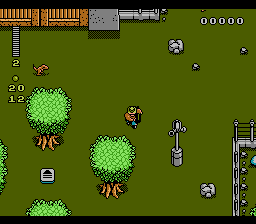

# Mapper

A mapper is a piece of hardware soldered to a cartridge's printed circuit board that allows the cartridge to perform various tasks.

MMC3 (Memory Management Controller 3):

The MMC3 is mapper 4 in the NES Header.

PRG ROM Size: Up to 512 KiB
PRG ROM Bank Size: 8 KiB
PRG RAM: Up to 8 KiB
CHR Capacity: Up to 256 KiB ROM or 8 KiB RAM
CHR Bank Size: Four 1 KiB and Two 2 KiB
Name Table Mirroring: Controlled by Mapper
Bus Conflicts: No

Object 8x16 Mode: BG must be Tile Pattern $0000 and OAM must be Tile Pattern $1000 in the $2000 Register.

## MMC3 Banks

```text
CPU $6000-$7FFF: 8 KiB PRG RAM Bank
CPU $8000-$9FFF or $C000-$DFFF: 8 KiB switchable PRG ROM Bank
CPU $A000-$BFFF: 8 KiB switchable PRG ROM Bank
CPU $C000-$DFFF or $8000-$9FFF: 8 KiB PRG ROM Bank, fixed to second-last bank
CPU $E000-$FFFF: 8 KiB PRG ROM Bank, fixed to last bank

PPU $0000-$07FF or $1000-$17FF: 2 KiB switchable CHR Bank
PPU $0800-$0FFF or $1800-$1FFF: 2 KiB switchable CHR Bank
PPU $1000-$13FF or $0000-$03FF: 1 KiB switchable CHR Bank
PPU $1400-$17FF or $0400-$07FF: 1 KiB switchable CHR Bank
PPU $1800-$1BFF or $0800-$0BFF: 1 KiB switchable CHR Bank
PPU $1C00-$1FFF or $0C00-$0FFF: 1 KiB switchable CHR Bank
```

## Memory Registers

```text
$8000 [Write] = Bank Select Register

%76543210
 ||   |||
 ||   +++- Bank Swap (000 = 2 KiB CHR Bank at PPU $0000-$07FF or $1000-$17FF,
 ||                   001 = 2 KiB CHR Bank at PPU $0800-$0FFF or $1800-$1FFF,
 ||                   010 = 1 KiB CHR Bank at PPU $1000-$13FF or $0000-$03FF,
 ||                   011 = 1 KiB CHR Bank at PPU $1400-$17FF or $0400-$07FF,
 ||                   100 = 1 KiB CHR Bank at PPU $1800-$1BFF or $0800-$0BFF,
 ||                   101 = 1 KiB CHR Bank at PPU $1C00-$1FFF or $0C00-$0FFF,
 ||                   110 = 8 KiB PRG ROM Bank at $8000-$9FFF or $C000-$DFFF,
 ||                   111 = 8 KiB PRG ROM Bank at $A000-$BFFF)
 |+------- PRG ROM Bank Mode (0 = $8000-$9FFF Swappable and $C000-$DFFF Fixed,
 |                            1 = $C000-$DFFF Swappable and $8000-$9FFF Fixed)
 +-------- CHR A12 Inversion (0 = Two 2 KiB Banks at $0000-$0FFF
                                  Four 1 KiB Banks at $1000-$1FFF,
                              1 = Four 1 KiB Banks at $0000-$0FFF
                                  Two 2 KiB Banks at $1000-$1FFF)

$8001 [Write] = Bank Data Register

%76543210
 ||||||||
 |||||||+- PRG ROM $2000  or CHR ROM $0400
 ||||||+-- PRG ROM $4000  or CHR ROM $0800
 |||||+--- PRG ROM $8000  or CHR ROM $1000
 ||||+---- PRG ROM $10000 or CHR ROM $2000
 |||+----- PRG ROM $20000 or CHR ROM $4000
 ||+------ PRG ROM $40000 or CHR ROM $8000
 |+-------                   CHR ROM $10000
 +--------                   CHR ROM $20000
```

When the $8000 Register is set to swap a 2 KiB CHR Bank, bit 0 is ignored in the $8001 Register.

```text
$A000 [Write] = Mirroring Register

%76543210
        |
        +- Mirroring (0 = Vertical, 1 = Horizontal)

$A001 [Write] = PRG RAM Protect Register

%76543210
 ||
 |+------- Write Protection (0 = PRG RAM is Readable/Writable, 1 = PRG RAM is Readable)
 +-------- PRG RAM Enable (0 = Disable PRG RAM, 1 = Enable PRG RAM)
```

## Scanline Registers

`$C000 [Write] = IRQ Latch Register`

The write value will be the IRQ Counter Reload Value.  The IRQ Counter decrements after each scanline if BG and/or OAM are enabled in the $2001 register.

MMC3 versions act differently when writing #$00 to $C000. MMC3A and non-Sharp MMC3B will generate a single IRQ because they generate the IRQ when the counter is decremented to 0.  MMC3C and Sharp MMC3B will generate an IRQ each scanline because they generate the IRQ when the counter is equal to 0.

`$C001 [Write] = IRQ Reload Register`

Any write value clears the IRQ Counter and reloads the IRQ Counter at the next rising edge of A12.  The A12 rising edge is PPU cycle 260 when the BG is Tile Pattern $0000 and PPU cycle 324 if the BG is Tile Pattern $1000.

`$E000 [Write] = IRQ Disable Register`

Any write value will disable MMC3 IRQs but the IRQ Counter will still decrement.

`$E001 [Write] = IRQ Enable Register`

Any write value will enable MMC3 IRQs.

## Mid-Frame

IRQs are generated mid-frame when the PPU is rendering the screen allowing us to do split screen effects without using the sprite 0 hit.

## Scrolling

During rendering, part of the scrolling address is being overwritten so we need to use code that will reload part of the scroll data during Horizontal Blank (the area at the end of the scanline off-screen before then next scanline at cycle 258-320) if we want a split scroll.  If the scrolling is not written during Horizontal Blank then a glitch will be visible on the split scanline.

```text
NN = Name Table (00 = Name Table 0, 01 = Name Table 1, 10 = Name Table 2, 11 = Name Table 3)

XXXXX = Coarse Horizontal Scroll    YYYYY = Coarse Vertical Scroll
|||||                               |||||
||||+- Scroll Right 8 Pixels        ||||+- Scroll Down 8 Pixels
|||+-- Scroll Right 16 Pixels       |||+-- Scroll Down 16 Pixels
||+--- Scroll Right 32 Pixels       ||+--- Scroll Down 32 Pixels
|+---- Scroll Right 64 Pixels       |+---- Scroll Down 64 Pixels
+----- Scroll Right 128 Pixels      +----- Scroll Down 128 Pixels

xxx = Fine Horizontal Scroll        yyy = Fine Vertical Scroll
|||                                 |||
||+- Scroll Right 1 Pixel           ||+- Scroll Down 1 Pixel
|+-- Scroll Right 2 Pixels          |+-- Scroll Down 2 Pixels
+--- Scroll Right 4 Pixels          +--- Scroll Down 4 Pixels
```

```nasm
	; DO BEFORE HBLANK
	LDA XSCROLL+1	; Get Horizontal Name Table
	LSR
	LDA YSCROLL+1	; Get Vertical Name Table
	ROL
	ASL
	ASL
	STA $2006		; Store %----NN--
	LDA YSCROLL+0	; Get Vertical Scroll
	STA $2005		; Store %YY---yyy (YY are the top 2 bits)
	ASL
	ASL
	AND #%11100000
	LDX XSCROLL+0	; Get Horizontal Scroll
	STA XSCROLL+0
	TXA
	LSR
	LSR
	LSR
	ORA XSCROLL+0
	; USE THIS SPACE TO WASTE TIME UNTIL HBLANK
	; DO DURING HBLANK
	STX $2005		; Store %-----xxx
	STA $2006 		; Store %YYYXXXXX (YYY are the bottom 3 bits)
  	STX XSCROLL+0	; Restore Value
```

## CHR Banks Switch

Since switching banks takes immediate effect, we can change banks mid-frame to use more than 256 tiles or simulate various tile effects.

The game Jurassic Park creates 4-way scrolling with horizontal mirroring by using an IRQ at the top and bottom area of the screen.  It does a CHR bank switch to display tiles between the scanlines and then a CHR bank switch to empty tiles after to display nothing so it can store the vertical scroll rows without any “screen artifacts” being shown.

We can see the top and bottom rows being blanked below.


